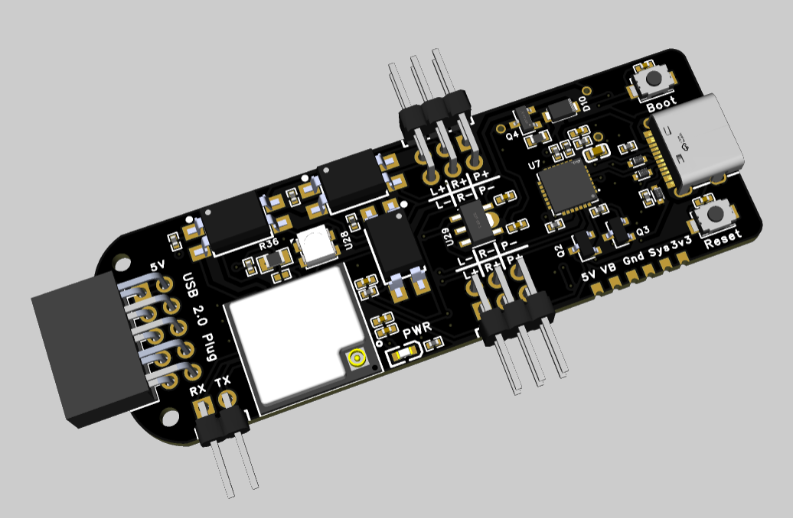
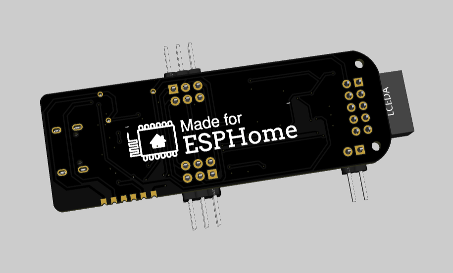



<b>Your PC needs this!</b>

 




<!--  -->

{}

{}

Your Server or NAS is in a different room or even a rack?

{}

{}
You want to automatically turn on, off your PC based on time or any other condition?
{}

{}
You have a powerful gaming PC but you can not turn it on with your TV or handheld like the Steam Deck?
{}

{}
Your kids tend to use the PC more than you would like.
You can easily create shutdown timers in Home Assistant.
{}

{}
Save 33% power by powering off your PC, NAS or Server over night (8 hours of sleep).
{}

{}
A local API that you can integrate into your project.
{}

{}

{}

As a nerd, you need the <b>pc-switch</b>! (Not the final product.)

{}

{}

{}
Regular power button functionality.
{}

{}
Regular reset button functionality.
{}

{}
If a normal shutdown does not work you can force your system with a hard reset as a last resort.
{}

{}
See when and how long your PC was ON or OFF.
{}

{}
Of course you can still use the power and reset button on your PC case.
{}

{}
The Web Interface allows you to control the PC on your phone and without Home Assistant.
{}

{}
You can integrate the pc-switch via a simple API to almost anything you like
{}

{}
We value your privacy
{}

{}
Everything is manageable via the web interface or the Home Assistant integration.
{}

{}
Everything is manageable via the web interface or the Home Assistant integration.
{}

{}
You can flash the standalone version, the Home Assistant version or any other software.
It is yours and will even work if the project is dead.
{}

{}
For you gamers, it has RGB!
For other, you can use it as status LED or turn it off.
{}

{}

{}

Proudly made with ESPHome

{}